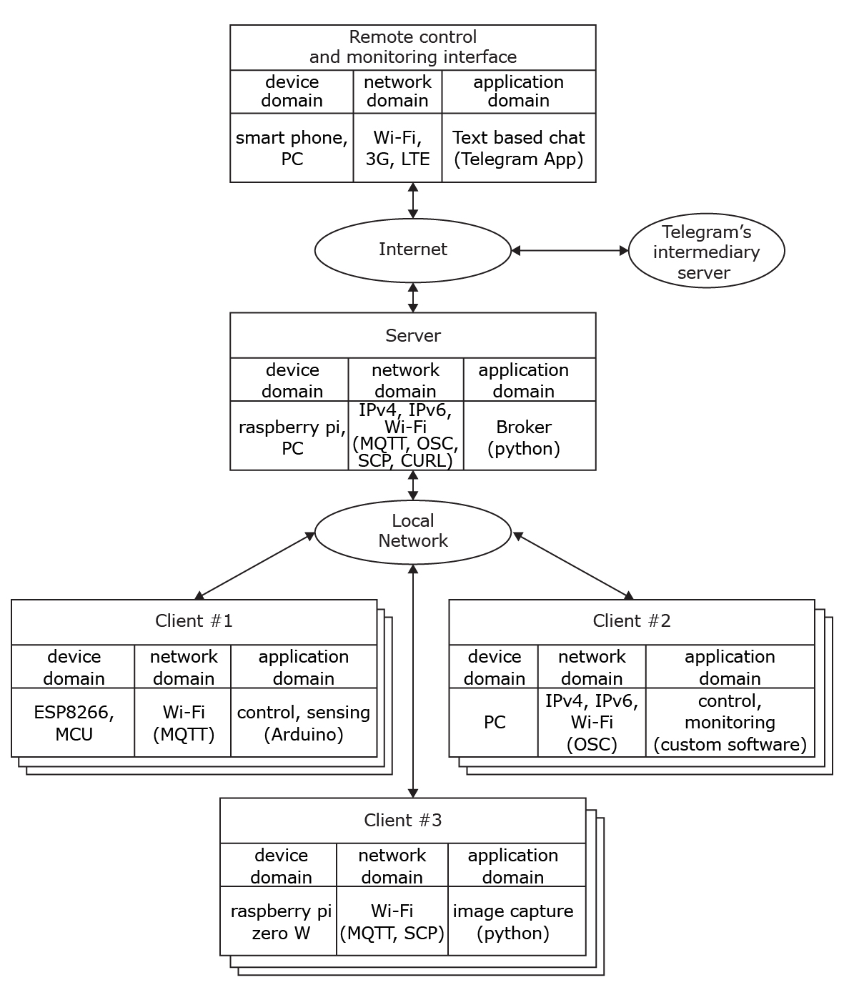
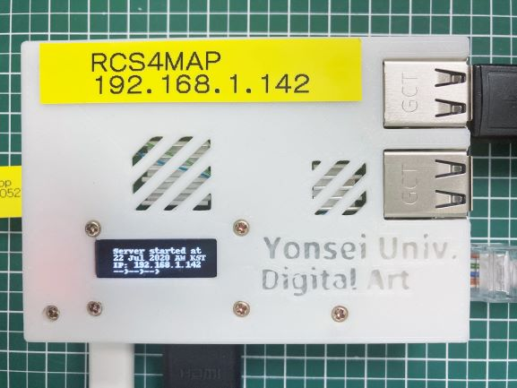
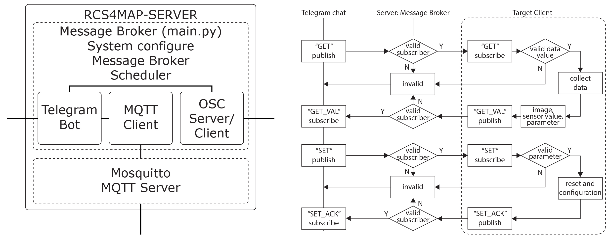

# RCS4MAP
remote control system for media arts

### 1. structure
</img> </img>
<br/><br/>
</img>

### 2. dependencies
```
sudo apt install -y mosquitto mosquitto-clients
sudo systemctl enable mosquitto.service
pip install telepot
pip install urllib3==1.9.1
pip install paho-mqtt
pip install apscheduler
pip install pyOSC
sudo apt install python-pil
```
######  Adafruit Python GPIO Library - deprecated    
######  Adafruit Python SSD1306 - deprecated


### 3. references
   * Mosquitto: <https://mosquitto.org/>
   * telepot: <https://telepot.readthedocs.io/en/latest/>
   * paho-mqtt: <https://github.com/eclipse/paho.mqtt.python>
   * APScheduler: <https://apscheduler.readthedocs.io/en/stable/userguide.html>
   * Adafruit Python GPIO Library: <https://github.com/adafruit/Adafruit_Python_GPIO>
   * Adafruit Python SSD1306: <https://github.com/adafruit/Adafruit_Python_SSD1306>
